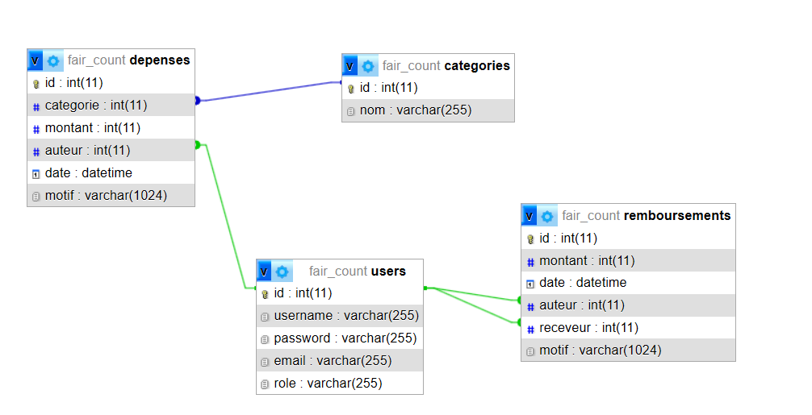

# Avant de lancer
Avant de commencer et de lancer le projet, vous devez d'abord créer dans votre phpmyadmin une base de données "fair_count" puis importer le fichier fair_count.sql situé dans le dossier db à la racine du projet.

Le projet utilise le module twig installé à l'aide de composer.

## Valeurs par défaut

Les tables SQL contiennent certaines valeurs par défaut afin de vous assurer du bon fonctionnement du projet. Elles contiennent en outre:

**Un Admin**
- username: Zariel
- email: lordof@the.first
- password: placeholder
- role: ADMIN

**Un User**
- username: Karlach
- email: avernus@sucks.fireemoji
- password: placeholder
- role: USER

**4 catégories**
- Transport
- Logement
- Nourriture
- Sorties

### schéma de la base sql:

